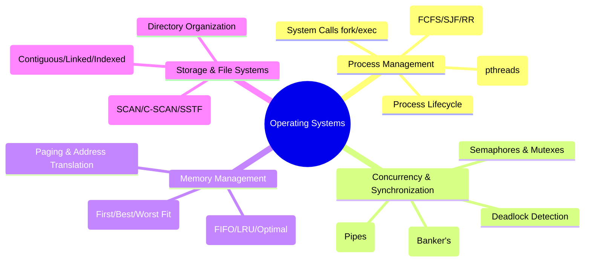

# 🖥️ Operating Systems Laboratory (OS Lab)

[](https://opensource.org/licenses/MIT)
[](https://www.kernel.org/)
[](https://en.wikipedia.org/wiki/C_(programming_language))
[](https://github.com/Sivasakthi-Vengatesan/os-)

A comprehensive collection of **15 Operating Systems Laboratory experiments, practical implementations, algorithms, and documentation** covering core OS concepts: Process Management, Concurrency, Deadlock, Memory Management, File Systems, and Disk Scheduling.

---

## 📚 Table of Contents & Experiments

| Exp # | Experiment Title | PDF Document | Key Concepts Covered |
|:---:|:---|:---|:---|
| **01** | OS Installation & Setup | [`Exp 01`](experiment-01-installation-windows-kali-linux.pdf) | Dual boot setup, Windows & Kali Linux installation, partitioning |
| **02** | Unix Commands & Shell Programming | [`Exp 02`](experiment-02-unix-commands-shell-programming.pdf) | Basic shell commands (`grep`, `awk`, `sed`, `chmod`), Bash scripts |
| **03** | POSIX System Calls | [`Exp 03`](experiment-03-system-calls.pdf) | Process creation & control (`fork`, `exec`, `getpid`, `exit`, `wait`) |
| **04** | CPU Scheduling Algorithms | [`Exp 04`](experiment-04-cpu-scheduling-algorithms.pdf) | FCFS, SJF (Preemptive/Non-preemptive), Round Robin, Priority |
| **05** | Inter-Process Communication (IPC) | [`Exp 05`](experiment-05-ipc-using-pipe.pdf) | Unidirectional & bidirectional IPC using UNIX Pipes (`pipe`, `read`, `write`) |
| **06** | Semaphore & Process Synchronization | [`Exp 06`](experiment-06-semaphore-implementation.pdf) | POSIX Semaphores (`sem_init`, `sem_wait`, `sem_post`), Producer-Consumer |
| **07** | Banker's Algorithm | [`Exp 07`](experiment-07-bankers-algorithm.pdf) | Deadlock avoidance, Safety algorithm, Resource Request evaluation |
| **08** | Deadlock Detection Algorithm | [`Exp 08`](experiment-08-deadlock-detection-algorithm.pdf) | Resource Allocation Graph (RAG) reduction, wait-for cycles detection |
| **09** | Multithreading with POSIX Threads | [`Exp 09`](experiment-09-threading-posix-pthreads.pdf) | Pthreads API (`pthread_create`, `pthread_join`, `pthread_mutex`) |
| **10** | Paging Memory Management | [`Exp 10`](experiment-10-paging-technique.pdf) | Logical to physical address translation, Page Tables, Frame allocation |
| **11** | Contiguous Memory Allocation | [`Exp 11`](experiment-11-memory-allocation-methods.pdf) | First Fit, Best Fit, Worst Fit allocation strategies & fragmentation |
| **12** | Page Replacement Algorithms | [`Exp 12`](experiment-12-page-replacement-algorithms.pdf) | FIFO, Least Recently Used (LRU), Optimal Page Replacement |
| **13** | File Organization Techniques | [`Exp 13`](experiment-13-file-organization-techniques.pdf) | Single-level, Two-level, and Hierarchical directory structures |
| **14** | File Allocation Strategies | [`Exp 14`](experiment-14-file-allocation-strategies.pdf) | Sequential (Contiguous), Linked, and Indexed file allocation |
| **15** | Disk Scheduling Algorithms | [`Exp 15`](experiment-15-disk-scheduling-algorithms.pdf) | FCFS, SSTF, SCAN (Elevator), C-SCAN, LOOK, C-LOOK algorithms |

---

## 🏛️ Core OS Subject Areas



---

## 🛠️ Compilation & Execution Guide (Linux / GCC)

Most OS practical programs are implemented in **C** using POSIX standard libraries.

### 1. Compiling Standard OS C Programs
```bash
# General C compilation
gcc -Wall -O2 program.c -o program
./program
```

### 2. Compiling Multithreaded & Semaphore Programs
```bash
# Link with pthread and realtime libraries
gcc -Wall -pthread experiment-06-semaphore.c -o semaphore_demo
gcc -Wall -pthread experiment-09-pthreads.c -o threads_demo
./threads_demo
```

### 3. Running Shell Scripts
```bash
chmod +x script.sh
./script.sh
```

---

## 📜 License

This repository is licensed under the [MIT License](LICENSE).
Feel free to use this reference material for academic, laboratory, and self-learning purposes.
